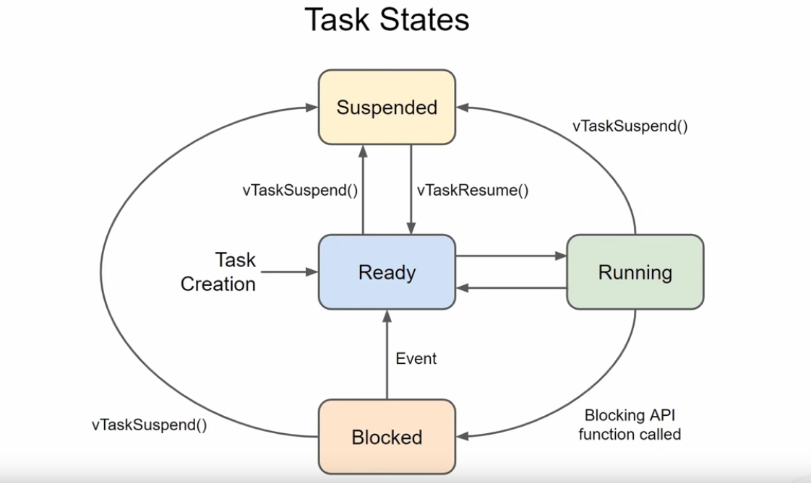
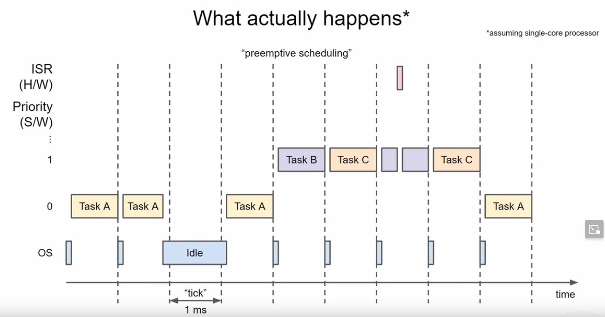

# Lecture 3
In this lecture we will learn about the task model in real time operating systems as well as how to use the serial receive hardware buffer in our (embedded) software.

## Basics
+ The tasks do not have any information about if they get interrupted by the scheduler or if they run infinitly
+ The scheduler does not know about the state a task is in. It has only access to the tasks priority!

## Task model

+ After creation (with `xTaskCreate`), a task (aka thread) goes to the ready state. This is done by registering the task by the scheduler and notify it that the task is ready to execute
+ A running task is the task that is currently assigned to the CPU. In a single core processor this can only be one task at a time!
    - After the task was executed and the scheduler decides that another task should be assigned to the CPU, the task goes back to the ready state and waits until the scheduler assigns the CPU to it back again.
+ If you call a `vTaskDelay` or another task blocking function from the task itself, it will go into the _blocked_ state until the condition (that is evaluated by the scheduler) is fulfilled.
+ Another possability to remove a task from the CPU is to manually suspend the task
    - This is useful if you want to execute a task based on an event or something similar
+ A task can be created (and therefore go into the _ready_ state) by calling `xTaskCreate` from a currently running thread.
+ A `vTaskDelay` counts the tick in which it was triggered as its first "blocked" tick

## Scheduling and priorities

+ A tick can contain multiple hardware clock cycles
    - ***A tick is NOT an execution of a single instruction***
    - ***It IS the minimum time slice during which a task can be executed***
+ The scheduler runs at the beginning of each tick and determines which task should be executed during that tick
+ A task can be creating by another task (e.g. Task A creates Task B and Task C). The assignment of the higher prioritized tasks B and C to the CPU can only be done after the tick has finished, because that is the next time (at least if task A does not stop itself from execution which will trigger the scheduler again) on which the scheduler will run and assign the CPU to the higher prioitized tasks.
+ A hardware and/or software interrupt can always get assigned to the CPU, since interrupts have direct trigger lanes to the CPU and the registers.
    - ISR (Interrupt Service Routines) should be programmed as short as possible!
        * Maybe they create a new task from which data from the acutal ISR will be processed

## Context switching
+ Everytime the scheduler assigns a new task to the CPU, the complete register set and the task stack are stored in RAM and the next tasks register set and stack is loaded to the CPU
    - Only with this context, a task can be suspended and resumed from the CPU without having knowlage about its internal state!
+ Context switching goes along with some processing overhead
    - Especially if the stack memory is big, since the complete stack is saved and restored on a context switch!
    - ***Therefor, we should assign a task only as much stack size as it needs to function properly and not more!***

## Ressources
+ https://www.programmingelectronics.com/serial-read/ 
    - Serial input tutorial and introduction
+ https://www.arduino.cc/reference/en/language/functions/communication/serial/
+ https://www.freertos.org/implementation/a00026.html
    - Theory Context switches

## Learnings from the homework
+ We need to clean the buffer to have it properly interpreted by `atoi`
    - This is done in C with `memset(target_ptr_start_address, value, length_of_memory)`
+ To allocate memory on the heap, we need `char* mem = malloc(sizeinbytes)`
+ To copy memory from one chunk of memory on the heap (or stack to heap or reverse), we need `memcpy`
+ The [serial interface](https://www.arduino.cc/reference/en/language/functions/communication/serial/) reads from the hardware serial buffer and can be read out byte by byte
    - There is no interpretation of datatypes on this level of abstraction. This needs to be done after we saved the serialized data to a buffer in RAM and then use the RAM and the program logic to interpret the received data
        * Make sure you have format checking