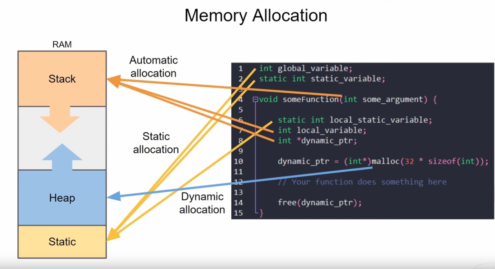

# Lecture 4: Memory Management

## General Memory Management
+ Low memory addresses (starting by `0x0`) are assigned to the static memory allocation. This is persistend memory allocation during the complete runtime of the ***device***!
+ After all static memory is allocated, the heap begins.
    - *Heap grows into memory address space!*
+ The Stack begins at the last valid memory address and grows downwards the memory address space.
    - A lower stack address means that the variable was stored later into the stack then a variable with a higher address number on the stack
    - *The stack grows down the address space* 

+ Stack and heap can grow into each other
    - This will cause undefined behaviour and sometimes major problems on your process/RTOS!

### Static Memory
+ Is persistend during runtime of the process (And on FreeRTOS during the complete runtime of the device). 
+ No function is able to delete static memory
    - Might be useful in medial applications

### Heap Memory
+ Needs to be allocated and freed manually by the programmer!
    - If not done, you will create a memory leak

### Stack Memory
+ Implements the _last in first out_ principal
+ Local variables from a scope or function/method parameters are stored there!
+ Also the _next instruction pointer_ is stored there when you enter a new function, so you can come back to the next instruction after you finished the function
    - A nested function is just poped off the stack after it has finished its execution
    - Memory is automatically deallocated after the function returns!
+ The main purpose of the stack is ***automatic memory allocation***

## Task Memory in FreeRTOS
+ If you create a new task, you need to define how much stack memory this task should get assigned. This memory is heap memory from the perspective of the process/FreeRTOS!
    - ***You tell FreeRTOS how much heap memory should be used to act as a stack for that process!***
    - Done by `xTaskCreate()`
+ Other heap memory that is allocated by a task on FreeRTOS will just stored upon the tasks heap-stack allocation
+ Besides the stack memory for the task, FreeRTOS also allocates memory for the task control block (TCB) which is needed for context switches!
+ Whenever we allocate memory on the heap with FreeRTOS, it will search for the largest continues block of memory
    - This will cause memory to fragment very quickly
    - You can use other memory allocation schemes! FreeRTOS can be configured to use other allocation strategies. You can look them up here: https://www.freertos.org/a00111.html 
+ Most often, heap 4 is used

## Memory Management on ESP32
+ Since the ESP32 has multiple RAM modules, espressive has implemented its own memory allocation scheme. You can read about them here: https://docs.espressif.com/projects/esp-idf/en/latest/esp32/api-reference/system/mem_alloc.html

## Practial example
+ Canarys:
    - https://www.sans.org/blog/stack-canaries-gingerly-sidestepping-the-cage/
    - The OS sets some known values at the end of the stack and periodically checks if these known values are still there.
        - If they are overwritten, a stack overflow happened and the process will reset (and therefore FreeRTOS)
        - And the canarys are dead ;/
+ All FreeRTOS tasks have 768 bytes overhead!
    - And everything that is needed on top can be calculated by the automatically allocated memory from the task (aka stack memory) based on the code
+ It is very important to use the FreeRTOS functions instead of libC functions because they are thread safe and FreeRTOS is mainly based on multithreaded programming!
+ You can have a look at the remaining stack memory (and therefor can trace memory issues) with the following functions:
    - `uxTaskGetStackHighWaterMark`: Caution  - this is the available stack memory in words! A word are 8 bit
    - `xPortGetFreeHeapSize`: Gives free heap memory in bytes
+ Use `pvPortMalloc` and `vPortFree` for heap allocation because they are thread safe
+ ***Always check return values of malloc!***

## Homework:
+ TBD